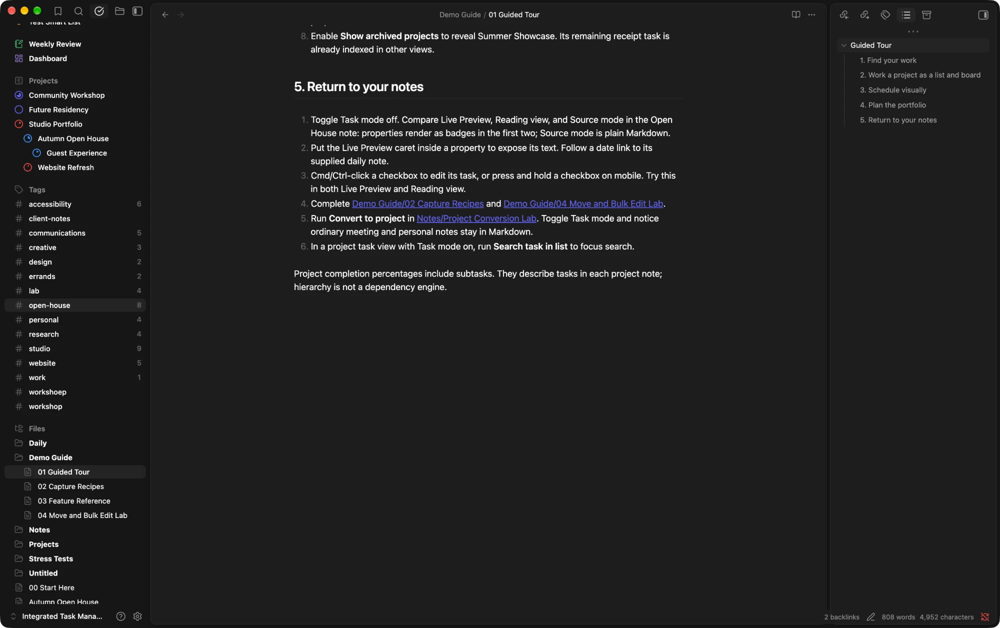

# Et Cetera

A calm, configurable theme for [Obsidian](https://obsidian.md). Pick a color scheme, then shape panes, transparency, borders and headings to taste. Everything is adjustable through the [Style Settings](https://github.com/mgmeyers/obsidian-style-settings) plugin.

## Features

- **Color scheme presets:** Things (default), Apple Notes, Bear, Griply and Obsidian, each with light and dark modes. Override the accent, backgrounds, text, borders and highlight independently.
- **Pane design:** make the left sidebar, editor and right sidebar flat or elevated cards (Griply elevates the editor and right sidebar by default). You can adjust the gap, corner radius, shadow strength, outline and the window color behind them. The settings window follows the same layout and colors, and stays opaque.
- **Left sidebar color:** pick any color. Text and icons switch between light and dark to stay readable, and the window behind an elevated editor follows it.
- **Enhanced transparency:** on by default. It replaces Obsidian's heavy grey overlay with a light tint so the desktop shows through. You can make just the sidebars see-through, or the whole window, and set separate tint strengths for light and dark mode.
- **UI borders:** borderless or hairline window edges, a custom UI border color, and optional rules under pane headers.
- **Headings:** color, size, weight, alignment, font, letter case, letter spacing, line height and spacing for all headings. Dividers under any heading levels, with their own color, thickness, style and gap. Every setting can be overridden per level, H1 to H6, and the note title has its own settings.
- **Markdown syntax:** optionally hide Markdown syntax (`#`, `**`, `==`, backticks, link brackets, `>`) on the line you're editing in Live Preview, or just the `#` before headings.
- **Lists & tasks:** checkbox shape and color, how completed tasks look, bullet color, list spacing, numbered-list style, indentation guides and hollow nested bullets. Alternate checkboxes get their own icons: `[/]` in progress, `[-]` cancelled, `[>]` forwarded, `[<]` scheduled, `[?]` question, `[!]` important, `[*]` star, `["]` quote, `[l]` location, `[b]` bookmark, `[i]` information, `[S]` savings, `[I]` idea, `[p]` pro, `[c]` con, `[f]` fire, `[k]` key, `[w]` win, `[u]` up and `[d]` down.
- **Tags & links:** tag style, shape, text, background and border colors and border thickness; link underlines.
- **Callouts:** tinted, outlined, side bar or minimal, with adjustable corner radius. Each color scheme picks its own default.
- **Properties:** plain, card or ruled; the Add property button can show on hover or hide; hide the Properties heading, show property icons only on hover, compact rows and property name width.
- **Tables:** grid, rows only, a rule under the header or no lines; shaded header, alternating rows, row hover highlight, tabular figures and full-width tables.
- **Diagrams & HTML:** Mermaid flowcharts, sequence diagrams, Gantt and pie charts take the scheme's colors in light and dark mode. `<kbd>` keys look like keycaps, `
` gets a frame, and `<mark>` matches `==highlights==`.
- **Status bar:** docked or a floating pill (the default in Apple Notes and Griply), at the bottom center (default) or bottom right, or hidden.
- **Hover to reveal (on by default):** the ribbon tucks away to a slim edge, a closed sidebar slides out over the editor from the window edge (or its toggle button) with the toggle button to keep it open, the note header and tab bar slide down from the top of the note, and the status bar and the vault / help / settings bar appear when hovered, all without shifting the editor. Set the edge width, open and close delays and the revealed sidebar width. The sidebar toolbars shrink to an ellipsis until hovered.

## Installation

1. Copy `theme.css` and `manifest.json` into `<your vault>/.obsidian/themes/Et Cetera/`.
2. In Obsidian, open **Settings → Appearance → Themes** and choose **Et Cetera**.
3. Install and enable the **Style Settings** community plugin to configure the theme. Without it, the theme uses its defaults.

For transparency, turn on **Settings → Appearance → Translucent window** (macOS).

## Configuration

Open **Settings → Style Settings → Et Cetera**. Settings are grouped into:

| Group | Sections |
| --- | --- |
| Colors | Color scheme, color overrides |
| Interface | Panes (with elevated cards), sidebars & menus, hover to reveal (with sidebar toolbars), transparency, borders, status bar, settings window |
| Editor | Typography & layout, Markdown syntax, headings (dividers, note title, H1–H6), lists & tasks, tags & links, callouts, properties, tables, diagrams |

Options marked *Scheme default* follow the active color scheme. Use the reset arrow next to any setting to return it to the scheme's value.

Fonts follow **Settings → Appearance → Font**, which always takes priority over the scheme.

## License

[MIT](LICENSE)
